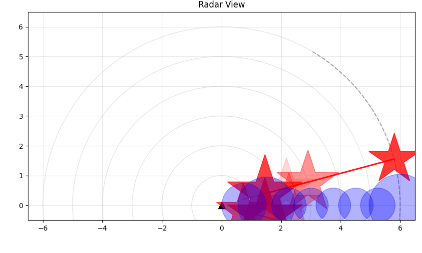
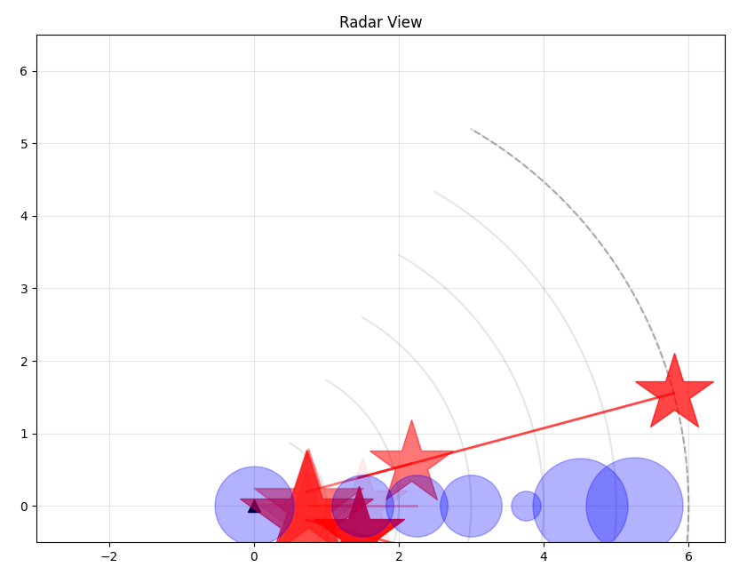
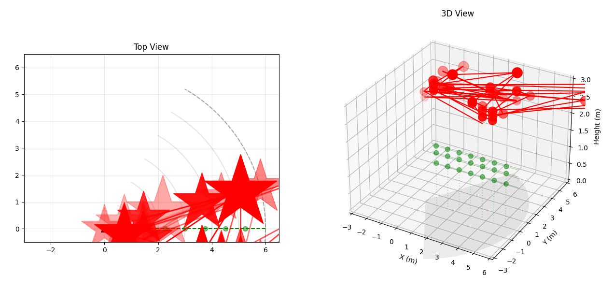
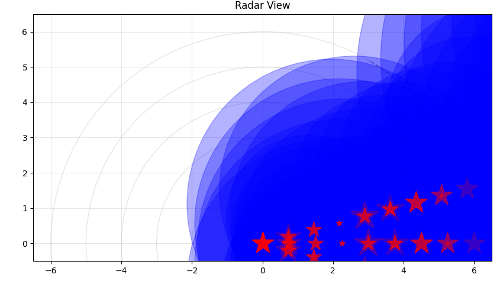

# Radar-24GHz-HLK-LD2410B
Tools for interfacing with the HLK-LD2410B 24GHz FMCW Radar Module, providing utilities for radar data visualization, engineering mode analysis, and sensor calibration.


## About the HLK-LD2410B

The HLK-LD2410B is a 24GHz FMCW (Frequency-Modulated Continuous Wave) radar module designed for human presence detection. Key features include:

- Detection range: Up to 5 meters
- Detection angle: ±60 degrees
- Can detect both moving and stationary targets
- Distance resolution: 0.75m per gate
- Configurable sensitivity and detection parameters
- Serial communication interface

## Requirements

- Python 3.7+
- pyserial
- numpy
- matplotlib
- Access to USB-to-Serial device (default: /dev/ttyUSB0)

## Installation

1. Clone this repository:
```bash
git clone https://github.com/yourusername/hlk-ld2410b-tools.git
cd hlk-ld2410b-tools
```

2. Install required Python packages:
```bash
pip install -r requirements.txt
```

3. Set proper permissions for the serial device:
```bash
sudo chmod 666 /dev/ttyUSB0
```

## Files Overview

### 1. radar_handler.py
Core interface class for the HLK-LD2410B radar module. Handles:
- Serial communication protocols
- Command processing
- Data frame parsing
- Basic and engineering mode data structures
- Buffer management for readings

### 2. engg_mode_demo_normed.py
Engineering mode demonstration that provides:
- Real-time visualization of radar gate data
- Energy level monitoring for each distance gate
- Movement interpretation and analysis
- Smoothed data visualization using moving averages

### 3. radar_visualizer.py
2D visualization tool featuring:
- Real-time radar data plotting
- Motion path tracking
- Detection range visualization
- Target energy level representation

### 4. radar_visualizer3D.py
Advanced 3D visualization including:
- Split view (2D top view + 3D perspective)
- Height estimation
- Expected movement paths
- Reference point visualization
- Motion trail tracking

### 5. calibrate_radar.py
Calibration utility providing:
- Distance measurement calibration
- Sensitivity optimization
- Environmental placement verification
- Factory reset capabilities
- Settings backup/restore

## Usage Examples

### Basic Radar Reading
```python
from radar_handler import RadarHandler

radar = RadarHandler("/dev/ttyUSB0")
reading = radar.read_frame()
if reading and reading.is_valid():
    print(f"Target State: {reading.target_state}")
    print(f"Detection Distance: {reading.detection_distance} cm")
```

### Engineering Mode Analysis
```python
python engg_mode_demo_normed.py
```

Example output:
```
Initializing radar on port /dev/ttyUSB0...
Enabling engineering mode...
Entering configuration mode...
Configuration mode enabled, setting engineering mode...
Engineering mode enabled successfully
Starting data collection (Press Ctrl+C to exit)...
--------------------------------------------------------------------------------
Timestamp: 1737945609.33
Target State: STATIC_TARGET
Detection Distance: 67 cm

Moving Energy Gates:
   Distance    Raw Energy         Smoothed
   --------    ----------         --------
   0.0m:    [███░░░░░░░░░░░░░░░░░]  18%    [███░░░░░░░░░░░░░░░░░]  18%
   0.8m:    [███░░░░░░░░░░░░░░░░░]  16%    [███░░░░░░░░░░░░░░░░░]  16%
   1.5m:    [██████████████████████████] 130%    [██████████████████████████] 130%
   2.2m:    [██████████████████████████] 133%    [██████████████████████████] 133%
   ...

Static Energy Gates:
   Distance    Raw Energy         Smoothed
   --------    ----------         --------
   0.0m:    [█████████████████████████] 128%    [█████████████████████████] 128%
   0.8m:    [█████████████████████████] 128%    [█████████████████████████] 128%
   1.5m:    [████████████████████] 100%    [████████████████████] 100%
   ...
```

The engineering mode provides detailed visualization of energy levels at each detection gate (0.75m intervals), showing both moving and static target detection strengths.

### 2D Visualization
```python
python radar_visualizer.py
```


### 3D Visualization
```python
python radar_visualizer3D.py
```



### Radar Calibration
```python
python calibrate_radar.py
```


## Configuration

The radar module can be configured through the following parameters:

1. Maximum Detection Distance
   - Movement detection: 0.75m - 6m (gates 1-8)
   - Static detection: 0.75m - 6m (gates 1-8)

2. Sensitivity
   - Adjustable per gate (0-100)
   - Higher values = more sensitive
   - Value of 100 disables detection for that gate

3. No-one Duration
   - Delay time before reporting no presence
   - Configurable in seconds

## Mounting Guidelines

For optimal performance:

1. Height:
   - Wall mounting: 1.5-2m
   - Ceiling mounting: ~3m

2. Clearance:
   - Keep area in front clear of moving objects
   - Avoid large reflective surfaces
   - Consider shielding behind radar
   - Minimize interference from AC/fans

## Troubleshooting

1. Serial Connection Issues:
   - Verify device permissions
   - Check USB connection
   - Confirm correct port assignment

2. Noisy Readings:
   - Verify mounting stability
   - Check for interference sources
   - Adjust sensitivity settings
   - Use engineering mode for detailed analysis

3. False Detections:
   - Calibrate sensitivity
   - Verify mounting conditions
   - Check for moving objects in detection zone

## Contributing

Contributions are welcome! Please feel free to submit a Pull Request.

## License

This project is licensed under the Apache License - see the LICENSE file for details.

## Credits

Based on documentation and protocol specifications from Hi-Link Electronic Co., Ltd.
http://www.hlktech.net/index.php?id=1183
